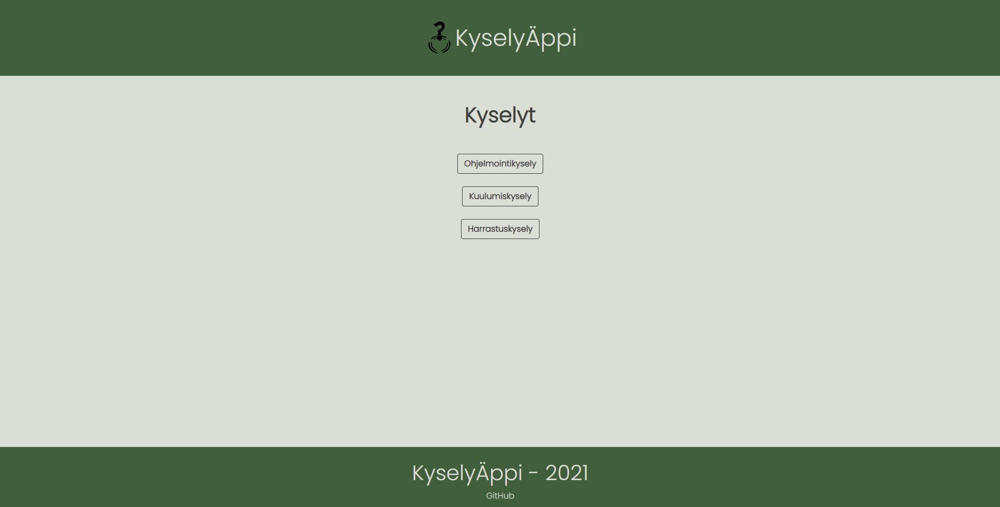
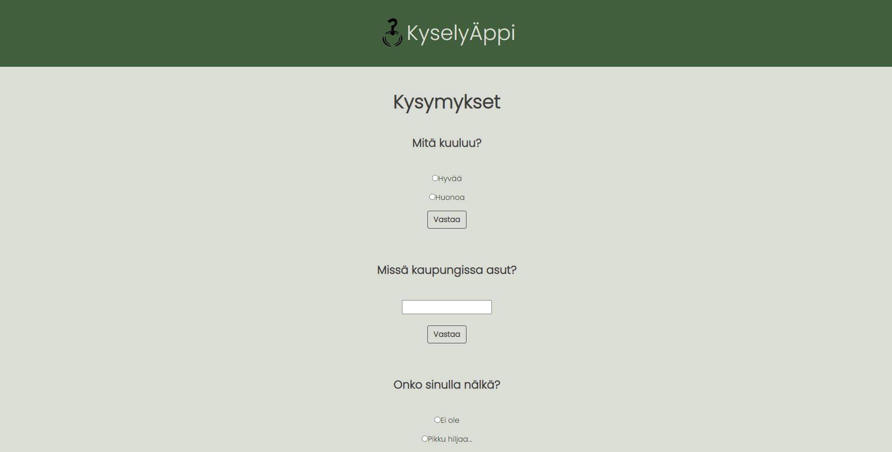
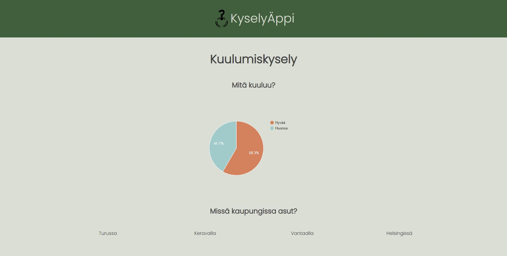

# Kyselyappi Front
Haaga-Helian ohjelmistoprojekti 1 kurssin front end puoli. 

## Käytetyt teknologiat
* [react-router-dom](https://reactrouter.com/web/guides/quick-start)
* [react-toast-notifications](https://github.com/jossmac/react-toast-notifications)
* [react-google-charts](https://react-google-charts.com/)
* [Bootstrap 5.0](https://getbootstrap.com/docs/5.0/getting-started/introduction/)

* [BACKEND](https://github.com/Temelius/ohjelmistoprojekti-1-backend)


# Käytön aloitus

## Vaatimukset

Asenna nämä aloittaaksesi
* npm

Ohjeet: [NPM](https://www.npmjs.com/get-npm)

* yarn

 ```sh
   npm install --global yarn
   ```

## Asennus

### Clone
   ```sh
   git clone https://github.com/Temelius/ohjelmistoprojekti-1-frontend.git
   ```
### Asenna NPM paketit
   ```sh
   npm install
   ```
### Käynnistä npm
   ```sh
   npm start
   ```

# Käyttö

Etusivulla voi valita kyselyn, johon haluaa vastata. Headerissa linkki etusivulle sekä logo.

 

Kyselysivulla kysymyksiin voi vastata yksi kerrallaan ja käyttäjä saa ilmoituksen jokaisesta onnistuneesta vastaustapahtumasta. Sivun alhaalla nappi, josta pääsee näkemään vastauksia.

 
 
Vastaussivulla nähdään kyselyyn vastattuja vastauksia. Radio muotoisista kysymyksistä näytetään Pie Chart ja teksti muotoisista kysymyksistä näytetään vastauksia sivulla listattuna.

 
